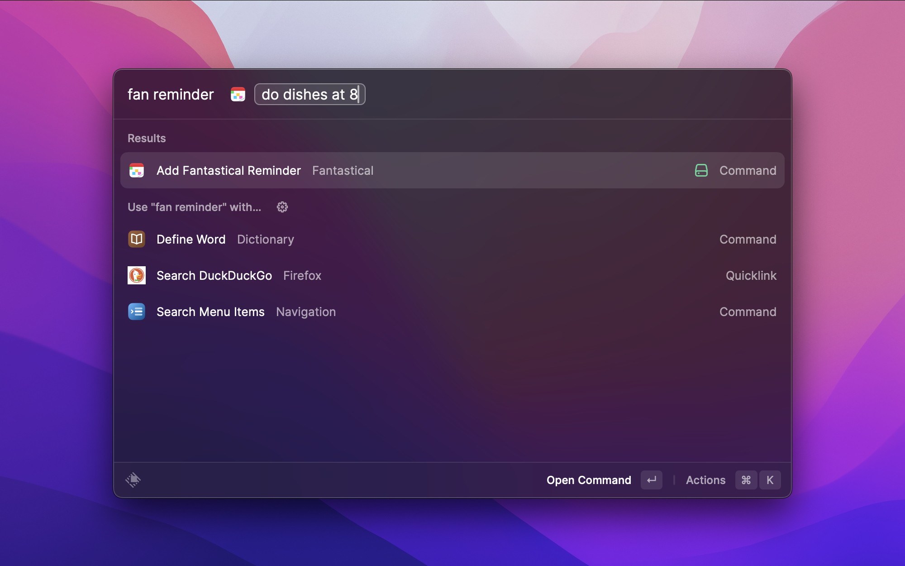

# Fantastical

This extension utilizes Fantastical natural language processing to add events and reminders from Raycast

### Adding Events

You can add events simply by typing `fan add event` or `add event` then type the event you want to add.

This will use Fantastical natural language processing to add events. If you are unfamiliar with Fantastical natural language processing you can read more [here](https://flexibits.com/fantastical/help/adding-events-and-tasks).

Here is an example of adding an event:

### Adding Reminders

Similarly to adding events, you can add reminders simply by typing `fan add reminder` or `add reminder` then type the reminder you want to add.

This will prepend the TODO keyword in front of the text that gets sent to Fantastical which will then create a reminder so its natural language processing will also be used.

Here is an example of adding a reminder:

